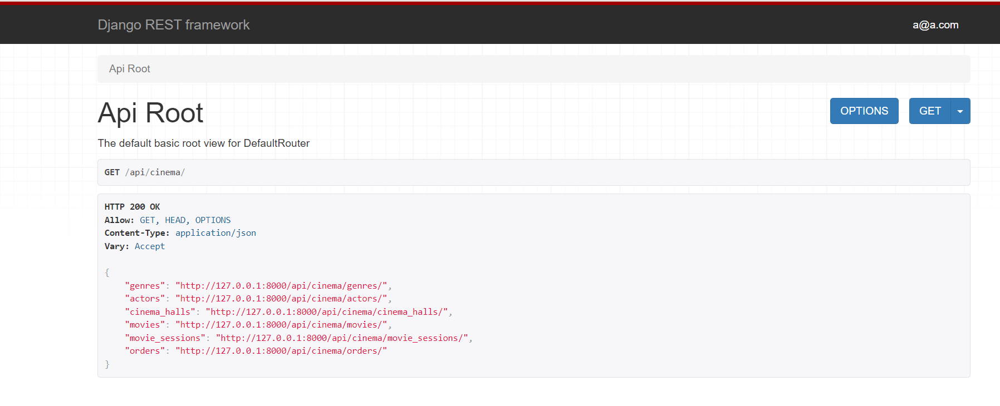
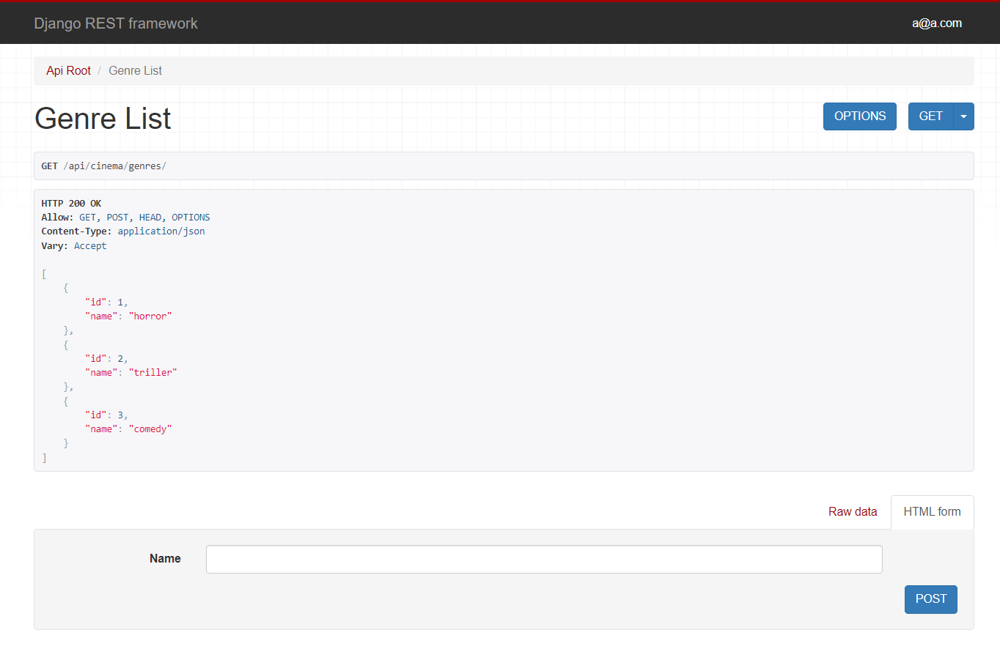
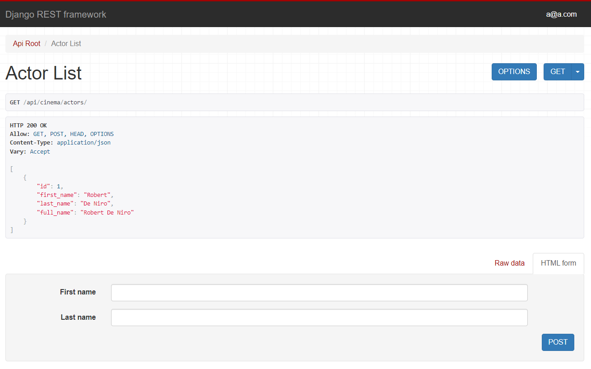
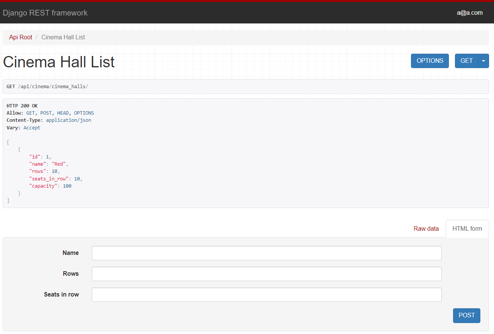
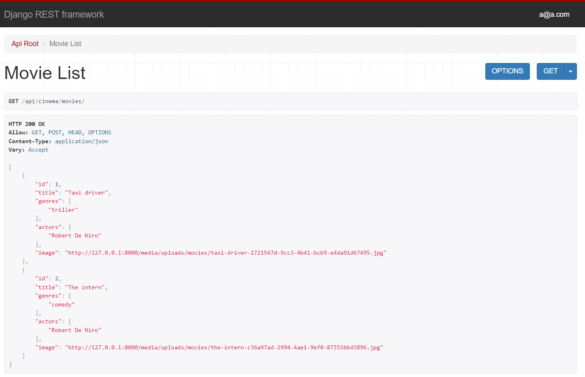

# Taxi service

API service for cinema management written using DRF

## Installation
Python3 must be already installed
```shell
git clone https://github.com/Hectorovich/cinema-service-API
cd cinema-service-API
python -m venv venv
venv/scripts/activate
pip install -r requirements.txt
set DB_HOST=<your db hostname>
set DB_NAME=<your db name>
set DB_USER=<your db username>
set DB_PASSWORD=<your db user password>
set SECRET_KEY=<your secret key>
python manage.py runserver
```
If you want to activate debug option you may set env
```
set DEBUG=True
```
# Run with docker
Docker should be installed
```
docker-compose build
docker-compose up
```
# Getting access
* create user on /api/user/register/
* get access token on /api/user/token/
## Features

* Managing orders and tickets
* Creating cinema halls
* Adding movie sessions with associated genres and cinema hall
* Filtering movies and movie sessions
* User and superuser functionality
* Admin panel for advanced managing
* Documentation is located at /api/doc/swagger/
## Demo




